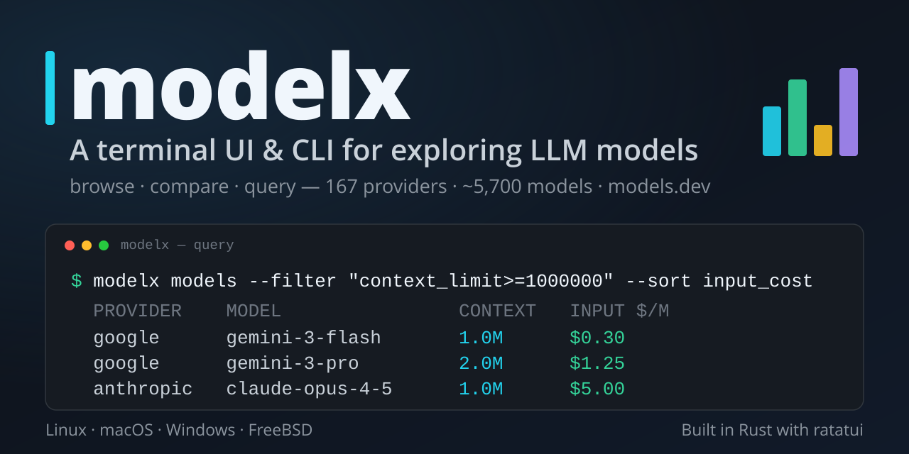
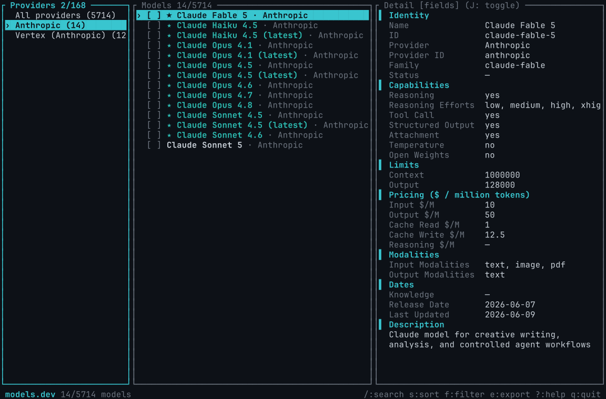
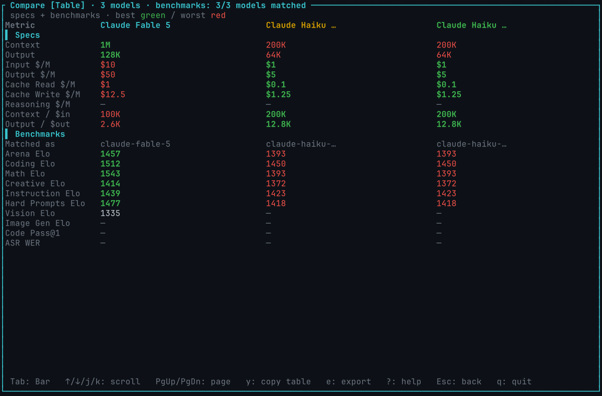
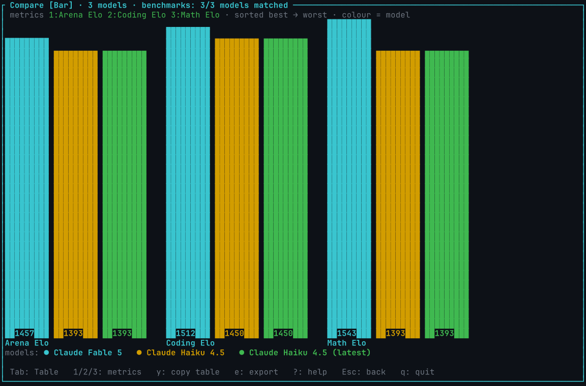

# modelx

[](https://github.com/alejandro-llanes/models-explorer/actions/workflows/ci.yml)
[](https://github.com/alejandro-llanes/models-explorer/releases/latest)
[](LICENSE)




**A terminal UI for exploring the full LLM model catalog — 167 providers, ~5,691 models, instant search.**

`modelx` connects to [models.dev](https://models.dev) and gives you a fast, keyboard-driven interface for browsing every LLM provider and model: context limits, pricing, modalities, capabilities, and raw JSON. It also works as a headless CLI **and a local JSON API** for scripting and automation.

## Screenshots



| Comparison · **Table** (specs + benchmarks) | Comparison · **Bar graph** (sorted best → worst, one colour per model) |
|:---:|:---:|
|  |  |

---

## Features

- **3-pane master-detail TUI** — Providers → Models → Detail, all keyboard-navigable
- **Instant startup** from a local cache, with a background refresh that hot-swaps when done
- **Fuzzy search** across provider and model names/IDs
- **Sort** by name, provider, context limit, cost, release date, and more
- **Filter** by capability: reasoning, tool-call support, open weights, modality, minimum context
- **Selection set** — mark individual models (`Space`), all in view (`a`), then export or compare
- **Comparison tool** (`c`) — a full-screen view for 2+ selected models with two display modes toggled by `Tab`: a **Table** view (transposed Specs + Benchmarks table; best value per row green, worst red; copy-as-Markdown, export) and a new **Bar** view (grouped benchmark bar chart for Arena Elo, Coding Elo, and Math Elo; each model keeps **one consistent colour** across every metric group — matching the table header and the colour-matched legend below — while best → worst reads off the left-to-right sort and bar height; `1`/`2`/`3` toggle which metrics are shown). Opening compare shows a toast if any selected models are missing benchmark data. Models that have benchmark data are flagged with a `★` marker in the Models pane.
- **Benchmark data** — `modelx bench` queries models enriched with benchmark scores; filter, sort, and export by any metric key (`arena_elo`, `coding_elo`, `math_elo`, …); run `modelx refresh` to populate the benchmark cache; see [docs/benchmarks.md](docs/benchmarks.md)
- **Export wizard** — choose fields, format (plain list, CSV, Markdown table, JSON), and destination (clipboard or file)
- **Copy to clipboard** — focused value (`y`) or full model JSON (`Y`)
- **Raw JSON view** — toggle to the unprocessed source object for any model
- **Rich headless CLI** — query by any field with comparison operators (`=`, `!=`, `<`, `>=`, `~`, …), sort/limit/count, choose output fields and format (`plain`, `csv`, `md`, `json`); plus dedicated `providers`, `bench`, `fields`, `show`, `sources`, `refresh`, `api`, and `completions` subcommands; catalog auto-refreshes after 12 h so you always query fresh data
- **Local JSON API** — `modelx api` starts a zero-dependency HTTP server exposing the full catalog on `127.0.0.1:8080`; optional `--refresh-interval` keeps it current in the background; ready to run in Docker
- **Offline mode** — works from cache with `--offline`
- **Cross-platform** — Linux, macOS, Windows, FreeBSD

---

## Install

### Prerequisites

A recent stable Rust toolchain ([rustup.rs](https://rustup.rs)).

### From source

```bash
git clone https://github.com/alejandro-llanes/models-explorer
cd models-explorer
cargo build --release
# binary is at target/release/modelx
```

### Install to PATH

```bash
cargo install --path crates/modelx-cli
```

---

## Complete guide

**[docs/guide.md](docs/guide.md)** — a thorough, task-oriented guide covering every use case: the TUI (panes, search, sort, filter, comparison Table and Bar views, export), the full CLI (all subcommands, filter expressions, output formats), and the HTTP API (routes, query parameters, curl recipes, Docker).

---

## Quick start

```bash
# Launch the TUI
modelx

# Launch on a specific source (currently only models.dev is available)
modelx --source models.dev

# Never hit the network; use the local cache only
modelx --offline
```

On first launch, `modelx` immediately begins fetching the full catalog in the background. While it loads, you see the cached data (or an empty state if no cache exists yet). A status indicator at the bottom shows when the refresh completes.

---

## TUI keybindings

| Key | Action |
|-----|--------|
| `q` / `Ctrl-C` | Quit |
| `Tab` / `l` | Focus next pane |
| `BackTab` / `h` | Focus previous pane |
| `j` / `k` / `↓` / `↑` | Move cursor down / up |
| `g` / `G` | Jump to top / bottom |
| `/` | Open search — searches the **focused pane**: filters providers when the Providers pane is focused, fuzzy-searches models when the Models pane is focused (`Enter` to confirm, `Esc` to clear) |
| `s` | Open sort menu (`d` or re-selecting a field toggles ascending/descending) |
| `f` | Open filter menu |
| `Space` | Toggle selection on focused model |
| `a` | Select all models in the current view |
| `A` | Clear the entire selection |
| `c` | Compare the selected models (2+) — opens the comparison view |
| `y` | Copy the focused field value to clipboard |
| `Y` | Copy the focused model as pretty JSON to clipboard |
| `e` | Open export wizard |
| `r` | Refresh the active data source |
| `S` | Open source picker |
| `?` | Toggle help overlay |
| `Esc` | Close the current overlay |
| `J` *(Detail pane)* | Toggle raw JSON view |

### Comparison view

Select 2+ models with `Space`, then press `c` to open the full-screen comparison view.
If any selected models have no benchmark data a toast appears immediately:
`⚠ N of M selected models have no benchmark data` (or `⚠ benchmark data not loaded — run \`modelx refresh\`` when the benchmark cache is empty).

The comparison has two display modes — press `Tab` / `BackTab` to switch between them.

**Table view** (default) — a transposed table (metric rows × model columns) split into two labelled sections:

- **▌ Specs** — context, output limit, per-million-token costs, and derived value metrics.
- **▌ Benchmarks** — a `Matched as` provenance row (which benchmark entry each model
  matched, or `—`), then one row per metric (Arena Elo, Coding, Math, Creative,
  Instruction, Hard Prompts, Vision, Image Gen, Code Pass@1, ASR WER). `—` when a model
  has no benchmark data. Best value per row is green, worst red (for ASR WER the best is
  the *lowest*). The title shows a coverage note like `benchmarks: 3/4 models matched`.

**Bar view** — a benchmark bar chart grouped by metric. Press `1`, `2`, or `3` to toggle
which metrics are displayed (at least one stays on; default: all three):

- `1` — Arena Elo
- `2` — Coding Elo
- `3` — Math Elo

Each active metric forms one group of bars, one bar per compared model that has a value
for that metric (models with no value are omitted from that group). Within each group the
bars are **sorted best → worst, left to right** and labelled with their Elo score. Each
model keeps **one consistent colour** across every metric group — the same colour used for
that model in the table header and in the colour-matched legend below — so colour maps to a
model at a glance, while best → worst is conveyed by the sort order and bar height. The
`models:` legend at the bottom pairs each colour swatch with the full model name.
If none of the selected models has benchmark data, the Bar view shows:
`No benchmark data for the selected models — run \`modelx refresh\`.`

Benchmark data is loaded from the local cache at startup — run `modelx refresh` once to
populate it. A model with no benchmark data still compares on specs in the Table view.

| Key | Action |
| --- | --- |
| `Tab` / `BackTab` | Switch between Table view and Bar view |
| `1` / `2` / `3` | Toggle Bar view metrics (Arena / Coding / Math Elo) |
| `↑` / `↓` / `j` / `k` | Scroll rows (Table view) |
| `PageUp` / `PageDown` | Page up / down (Table view) |
| `y` | Copy the benchmark **table** as a Markdown table |
| `e` | Open the export wizard for the compared models |
| `Esc` / `c` | Return to the browser (selection preserved) |
| `q` / `Ctrl-C` | Quit |
| `?` | Help |

---

## Headless CLI

Running `modelx` with no arguments opens the TUI. Passing a subcommand runs a headless action and exits. All subcommands accept these global flags:

```
--source <id>      Use a specific registered data source
--offline          Serve from cache only; error if no cache exists
--config <path>    Use a custom config file
```

Before any data subcommand (`providers`, `models`, `show`) modelx checks whether the cache is missing or older than 12 hours. If so, it auto-fetches the active source and prints a short notice to stderr (stdout stays clean for pipes). Pass `--offline` to suppress this. Use `modelx refresh` to force an update at any time.

### `modelx providers`

Lists the LLM providers/vendors in the catalog.

```
modelx providers [--filter <PATTERN>] [--regex] [--fields <keys>] [--sort <col>]
                 [--desc] [--limit <N>] [--count] [--format <fmt>] [--output <FILE>]
```

`--filter` is a case-insensitive substring match on provider `id` or `name`; add `--regex` to treat it as a regular expression. Provider columns available for `--fields` and `--sort`: `id`, `name`, `npm`, `api`, `doc`, `env`, `models` (where `models` is the provider's model count). Default fields: `id,name,models`.

```bash
modelx providers --filter anthro
modelx providers --fields id,name,models --sort models --desc --limit 3 --format json
```

### `modelx models`

The main query subcommand. `list` and `export` are aliases kept for compatibility.

```
modelx models [--filter <"FIELD OP VALUE">]… [--provider <P>] [--search <Q>]
              [--regex] [--fields <keys>] [--sort <field>] [--desc]
              [--limit <N>] [--count] [--format <fmt>] [--output <FILE>]
```

- `--filter` is repeatable; all expressions are AND-combined. The format is `"FIELD OP VALUE"` — see [Filter expressions](#filter-expressions) below.
- `--provider` narrows by provider: case-insensitive substring on provider `id` or `name`.
- `--search` is a case-insensitive substring across provider name, model name, and model id.
- `--regex` makes both `--provider` and `~`/`!~` filter operators treat their value as a regex.
- `--count` prints a single integer (the number of matching models) instead of rows.
- Default fields: `provider_id,id,name`.

**Examples:**

```bash
# Cheapest big-context models
modelx models --filter "input_cost<=1" --filter "context_limit>=200000" \
              --fields provider_id,id,context_limit,input_cost --sort input_cost --limit 5

# Anthropic models whose name contains "opus", as JSON
modelx models --provider anthropic --filter "name~opus" --fields id,name,input_cost --format json

# Count reasoning-capable models
modelx models --filter "reasoning=true" --count

# Word-form operator: context ≥ 1 M tokens
modelx models --filter "context_limit gte 1000000" --count

# Models released in 2026 or later, newest first, as a Markdown table
modelx models --filter "release_date>=2026-01-01" --sort release_date --desc --limit 3 --format md

# Regex: Anthropic claude-opus-4 or claude-sonnet-4 model IDs
modelx models --regex --provider anthropic --filter 'id~^claude-(opus|sonnet)-4' --fields id

# Alias still works
modelx export --provider anthropic --filter "name~haiku" --fields id,name,input_cost --format csv
```

### Filter expressions

The argument to `--filter` is a quoted string: `"FIELD OP VALUE"`. Both symbol and word forms of each operator are accepted:

| Symbol | Word | Meaning |
|--------|------|---------|
| `<` | `lt` | less than |
| `<=` | `lte` | less than or equal |
| `=` | `eq` | equals |
| `!=` | `ne` | not equal |
| `>=` | `gte` | greater than or equal |
| `>` | `gt` | greater than |
| `~` | `contains` | contains (substring, or regex with `--regex`) |
| `!~` | `ncontains` | does not contain |

Comparison semantics depend on the field's type (inspect with `modelx fields`):

- **number** — `context_limit`, `output_limit`, `*_cost` fields: numeric comparison.
- **text** — all string fields including `release_date`, `last_updated`, `knowledge`: case-insensitive string comparison. Because ISO dates sort lexically, `release_date>=2025-01-01` works correctly.
- **bool** — `reasoning`, `tool_call`, `open_weights`, etc.: accepts `true/false/yes/no/1/0`.
- **list** — `input_modalities`, `output_modalities`: use `~` to test membership.

Missing values never satisfy an ordering or equality filter.

### `modelx bench`

Alias: `benchmarks`. Queries models enriched with benchmark scores. Accepts all the same flags as `modelx models`, plus benchmark metric keys are valid in `--filter`, `--fields`, and `--sort`. A coverage note (`<N>/<M> models have benchmark data`) is printed to **stderr**; missing benchmark values render as `—`.

```
modelx bench [--filter <"FIELD OP VALUE">]… [--provider <P>] [--search <Q>]
             [--regex] [--fields <keys>] [--sort <key>] [--desc]
             [--limit <N>] [--count] [--format <fmt>] [--output <FILE>]
             [--offline]
```

Default fields: `provider_id,id,name,arena_elo,coding_elo,math_elo`.

```bash
# Top Anthropic models by coding score
modelx bench --provider anthropic --fields id,name,arena_elo,coding_elo,math_elo \
             --sort coding_elo --desc --limit 5

# Models with a coding Elo of 1500 or above
modelx bench --filter "coding_elo>=1500" --fields provider_id,id,coding_elo \
             --sort coding_elo --desc --limit 8

# Cheap Anthropic models with their Arena Elo, as JSON
modelx bench --provider anthropic --filter "input_cost<=10" \
             --fields id,name,input_cost,arena_elo --format json
```

**Benchmark metric keys** (valid in `--filter`, `--fields`, `--sort`):

| Key | Label | Higher better? |
|-----|-------|---------------|
| `arena_elo` | Arena Elo | yes |
| `coding_elo` | Coding | yes |
| `math_elo` | Math | yes |
| `creative_elo` | Creative | yes |
| `instruction_elo` | Instruction | yes |
| `hard_prompts_elo` | Hard Prompts | yes |
| `vision_elo` | Vision | yes |
| `imagegen_elo` | Image Gen | yes |
| `code_pass_at_1` | Code Pass@1 | yes |
| `asr_wer` | ASR WER | **no** (lower is better) |

See [docs/benchmarks.md](docs/benchmarks.md) for data sources, matching rules, and caveats.

### `modelx fields`

Lists every model field with its machine key, human label, and type (`text`, `number`, `bool`, or `list`). Also prints a **Benchmarks** section with the 10 metric keys, their labels, sources, and higher-is-better flags. Does not touch the network.

```bash
modelx fields
modelx fields --format json
```

### `modelx show`

Prints the full detail for one model. Default format is `json` (the unprocessed source object).

```
modelx show <provider> <model> [--format <fmt>]
```

Provider and model are resolved by exact id first, then by substring. An error is printed clearly on no match or an ambiguous match.

```bash
modelx show anthropic claude-opus-4-5
```

### `modelx refresh`

Force-fetches the active source and updates the on-disk catalog cache. Also refreshes the benchmark cache (all three leaderboard sources). Exits non-zero if any fetch fails.

```bash
modelx refresh
modelx refresh --source models.dev
```

### `modelx sources`

Lists all registered data sources and the age/status of their cached catalogs.

```bash
modelx sources
```

### `modelx completions`

Prints a shell completion script to stdout. Supported shells: `bash`, `zsh`, `fish`, `powershell`, `elvish`.

```bash
modelx completions bash > modelx.bash
source modelx.bash
```

### Output formats

All data subcommands accept `--format <fmt>`:

| Format | Description |
|--------|-------------|
| `plain` / `list` | Default. One row per model; tab-separated when multiple fields are selected. |
| `csv` | Comma-separated values with a header row. |
| `md` / `markdown` | GitHub-flavored Markdown table. |
| `json` | Array of objects keyed by field machine key. |

`--output <FILE>` writes to a file instead of stdout.

**Field keys** accepted by `--fields` and `--sort`: `provider_id`, `provider_name`, `id`, `name`, `description`, `family`, `status`, `context_limit`, `output_limit`, `input_cost`, `output_cost`, `cache_read_cost`, `cache_write_cost`, `reasoning_cost`, `reasoning`, `tool_call`, `structured_output`, `attachment`, `temperature`, `open_weights`, `knowledge`, `release_date`, `last_updated`, `input_modalities`, `output_modalities`, `reasoning_efforts`. Run `modelx fields` to see the full list with types.

---

## HTTP API

`modelx api` starts a local synchronous HTTP server that exposes the catalog as JSON. No async runtime, no authentication — it is a local scripting tool.

```
modelx api [--listen-addr <ADDR>] [--listen-port <PORT>] [--refresh-interval <DUR>]
```

Defaults: `--listen-addr 127.0.0.1`, `--listen-port 8080`, no auto-refresh. Pass `--refresh-interval 1h` (or `30s`, `10m`, `2d`, or a bare integer = seconds) to have a background thread re-fetch and hot-swap the catalog and benchmarks on that interval.

**Route table (all `GET`, all return `application/json`):**

| Path | Description |
|------|-------------|
| `/health` | Status, source, model count, provider count, `fetched_at`, benchmark availability |
| `/sources` | Registered data sources with cache age |
| `/fields` | All model field keys + benchmark metric keys with types and metadata |
| `/providers` | Provider list — query params: `filter`, `fields`, `sort`, `desc`, `limit`, `regex` |
| `/models` | Model list — query params: `filter` (repeatable, AND), `provider`, `search`, `regex`, `fields`, `sort`, `desc`, `limit` |
| `/models/{provider}/{model}` | Raw source object for one model; `404` if not found |
| `/bench` | Models with benchmark scores — same params as `/models`; benchmark metric keys valid in `filter`/`sort` |

Filter values containing `<`, `>`, `=`, or `,` must be URL-encoded (e.g. `<=` → `%3C%3D`). A bad filter/field/sort returns `400 {"error":"..."}`.

**Examples:**

```bash
modelx api --refresh-interval 1h           # serve 127.0.0.1:8080, refresh every hour

curl 'http://127.0.0.1:8080/health'
curl 'http://127.0.0.1:8080/models?provider=anthropic&limit=5&fields=id,name,input_cost'
curl 'http://127.0.0.1:8080/models?filter=input_cost%3C%3D1&filter=context_limit%3E%3D200000&sort=input_cost&limit=10'
curl 'http://127.0.0.1:8080/bench?filter=coding_elo%3E%3D1500&fields=provider_id,id,coding_elo&sort=coding_elo&desc=true&limit=10'
curl 'http://127.0.0.1:8080/models/anthropic/claude-opus-4-6'
```

See [docs/guide.md](docs/guide.md#part-3--api) for the full route reference, query-parameter semantics, and more curl recipes.

---

## Docker

A `Dockerfile` in the repository root builds a fully static musl binary and runs it on a minimal Alpine image (CA certs, non-root user, `/data` volume for the cache). The default command runs `modelx api` on all interfaces.

```bash
docker build -t modelx .

# Run the API (ephemeral cache)
docker run --rm -p 8080:8080 modelx

# Persist the cache across restarts
docker run --rm -p 8080:8080 -v modelx-data:/data modelx

# Run a CLI subcommand instead
docker run --rm modelx models --provider anthropic --fields id,name --format json
```

The `ENTRYPOINT` is `modelx`, so any subcommand works. The TUI needs a real terminal and is not the Docker use case.

---

## Performance & size

The release binary is optimized for startup speed and minimal size: `opt-level=3`, fat LTO, `codegen-units=1`, symbols stripped, `panic="abort"` (the TUI panic hook still restores the terminal before exit). Prebuilt binaries are available on the [Releases page](https://github.com/alejandro-llanes/models-explorer/releases/latest).

---

## Configuration

`modelx` looks for an optional TOML config file in the platform config directory. A missing file uses built-in defaults.

**Default locations:**
- Linux: `~/.config/modelx/config.toml`
- macOS: `~/Library/Application Support/dev.modelx.modelx/config.toml`
- Windows: `%APPDATA%\modelx\modelx\config\config.toml`

Override with `--config <path>`.

```toml
default_source = "models.dev"

[cache]
ttl_hours = 12

[ui]
theme = "default"
```

All keys are optional.

---

## Data sources and caching

`modelx` has a `DataSource` abstraction that separates the *source of the catalog* (where the data comes from) from the *LLM providers and vendors* (Anthropic, OpenAI, Google, etc.) that appear *inside* that catalog. The current version ships with one data source: **models.dev**.

The fetched catalog is stored as JSON on disk:

| Platform | Cache path |
|----------|-----------|
| Linux | `~/.cache/modelx/sources/models.dev.json` |
| macOS | `~/Library/Caches/dev.modelx.modelx/sources/models.dev.json` |
| Windows | `%LOCALAPPDATA%\modelx\modelx\cache\sources\models.dev.json` |

Cache writes are atomic (write to a temporary file in the same directory, then rename). The default TTL is 12 hours (`cache.ttl_hours` in config); `modelx` starts from the cache regardless of age and refreshes in the background. Pass `--offline` to suppress all network requests.

See [docs/data-sources.md](docs/data-sources.md) for the full caching spec and how to add new data sources.

---

## Platform support

| Platform | Status |
|----------|--------|
| Linux (X11 / Wayland) | Supported |
| macOS | Supported |
| Windows | Supported |
| FreeBSD | Supported |

---

## Project layout

```
models-explorer/
├── Cargo.toml                 # virtual workspace manifest
├── crates/
│   ├── modelx-core/           # domain types, field registry, query engine (pure, no I/O)
│   ├── modelx-datasource/     # DataSource trait, registry, models.dev HTTP source
│   ├── modelx-cache/          # atomic on-disk cache (platform directories)
│   ├── modelx-export/         # renders selections to plain list / CSV / Markdown / JSON
│   ├── modelx-tui/            # ratatui UI: state machine, widgets, event loop, theme
│   └── modelx-cli/            # binary `modelx`: clap CLI, config, wiring, background refresh
└── docs/
    ├── architecture.md        # crate contracts and integration details
    ├── usage.md               # full TUI and CLI usage guide
    └── data-sources.md        # caching, offline use, adding new sources
```

See [docs/architecture.md](docs/architecture.md) for the full crate-level contracts and dependency graph.

---

## Development

```bash
# Run all tests
cargo test --workspace

# Lint (warnings are errors)
cargo clippy --workspace --all-targets -- -D warnings

# Format check
cargo fmt
```

The core, datasource, cache, and export crates are unit-tested; datasource and export tests run against committed fixture files.

---

## Caveats

- **Clipboard persistence on Linux/X11:** content copied with `y` or `Y` may not survive after `modelx` exits unless a clipboard manager (e.g. `xclip`, `clipman`, `copyq`) is running. This is a known limitation of the underlying `arboard` library on X11. Wayland is unaffected.
- **Single data source:** models.dev is the only data source in this release. The `DataSource` trait and registry are in place for additional sources in the future.

---

## License

MIT — see [LICENSE](LICENSE).

---

## Acknowledgements

Model data is provided by [models.dev](https://models.dev) — a comprehensive, community-maintained catalog of LLM providers and models. Many thanks to the models.dev contributors.
